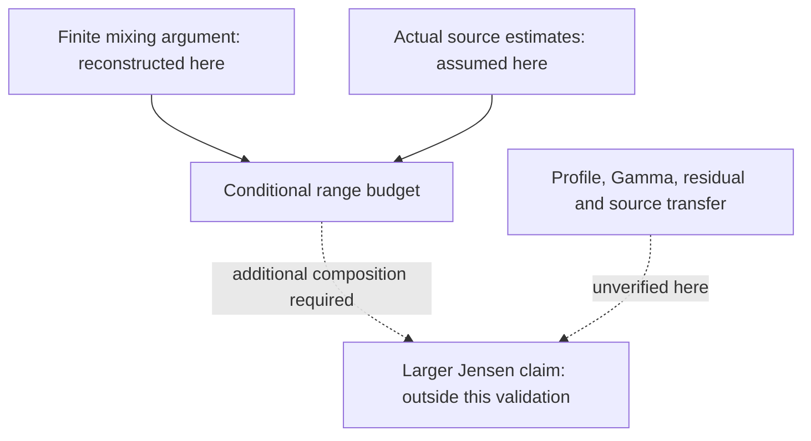

# Jensen program: improving a bound without losing its dependencies

This case follows a sustained research program in which several estimates had
to compose before a claim about Jensen polynomials could follow. A coarse error
charge made retained complementary mass look like a limiting factor. The
research revisited the underlying measures and recovered a factor of the bin
width by accounting for that mass locally. Every atom, including the terminal
one, remained in the calculation.

The public example reconstructs that finite argument and the Hilbert-space
phase estimate it feeds. It then derives the conditional power/logarithm budget
behind the recorded `2/19` range. The actual-source analytic estimates and the
remaining transfer to Jensen roots are separate dependencies, unverified by
this package. The larger historical candidate was noncanonical and open.

In that larger program, `R` controls polynomial degree relative to a large
coefficient-index parameter. A larger admissible `R` would enlarge the proposed
range of polynomials with real roots. Here the inspectable contribution is the
finite estimate and the exact conditions on its resulting budget.

| Layer | What a reader can inspect here |
| --- | --- |
| Finite geometry | A complete argument for bin-local complementary mass, whole-cell quadrature and triangular Fejer mixing. |
| Phase perturbation | The full Hilbert bound, including the original affine budget and its cross term. |
| Executable witness | A newly authored finite configuration checked with rigorous interval arithmetic, plus exact algebraic identities. It is not actual theta-source data. |
| Conditional range | Why the supplied error scales permit `A < 2/19`, and why the logarithmic boundary requires an ordered choice of constants. |
| Larger application | Explicit source-motion and analytic-transfer dependencies; no certified Jensen hyperbolicity theorem or RH result. |

Start with the [mathematical note](mathematics.md). The
[provenance](provenance.md) explains the retained research and the distinction
between its interpretations and this new reconstruction.



## Run the checker

With Python 3.12 in your own virtual environment:

```sh
python -m pip install -r examples/jensen-program/requirements.txt
python examples/jensen-program/check.py
```

No model, account or server is required. The finite witness exercises retained
mass and the complete mixing bound. Finite calculations do not replace the
general proof or establish the analytic hypotheses. See the
[recorded output](checker-output.json) and [validation](validation.md).

## Inspect the dependencies in the real store

On Linux, with the checker dependencies above installed:

```sh
python -m pip install -r requirements-dev.txt
python scripts/research_example.py run --example jensen-program --output .research/jensen
python scripts/research_example.py inspect --output .research/jensen --details
```

The walkthrough captures exact inputs and fresh checker output, records the
bounded mathematical conclusion, and makes the range claim refer to the
analytic hypotheses it needs. After checkpointing, a new process reads the
same source bytes and exact Candidate revisions. The
[recorded summary](store-summary.json) is readable without installation.

The judgments are supplied by the example authors. This is an authored use of
the actual research core, not a new model run or a replay of private research.
The [first example](../finite-free-localization/README.md) provides the separate
live executive and successor evidence.

## What this shows about the system

Research can accumulate useful results without closing the final problem.
Here, revisiting one estimate changes the available parameter budget while
leaving the analytic interfaces visible. The software makes those distinctions
inspectable through [exact evidence sources](../../packages/research-core/research_core/mission_evidence.py),
[versioned research operations](../../packages/research-core/research_core/mission_interface.py)
and the [durable store](../../packages/research-core/research_core/workspace_store.py).
It does not decide whether a proof is correct.

Justin Sublette directed the system's design, development and research workflow
with AI assistance. This example is evidence of that engineering and a bounded
research process; it does not establish a general autonomous-research success
rate, novelty or a mathematical breakthrough.
